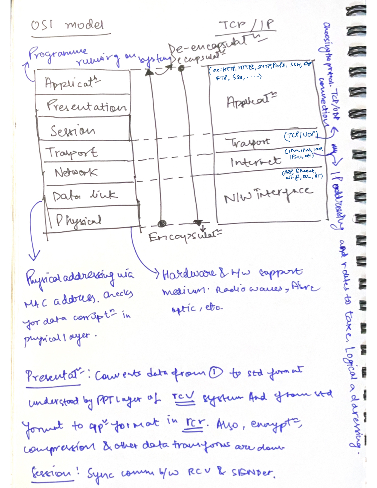
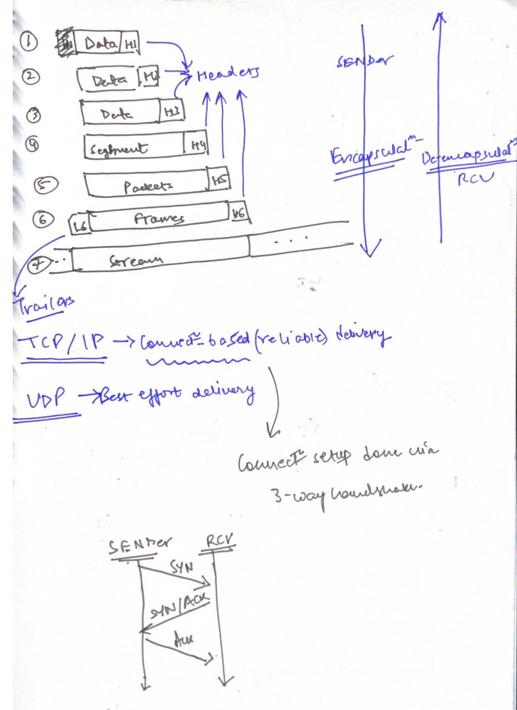
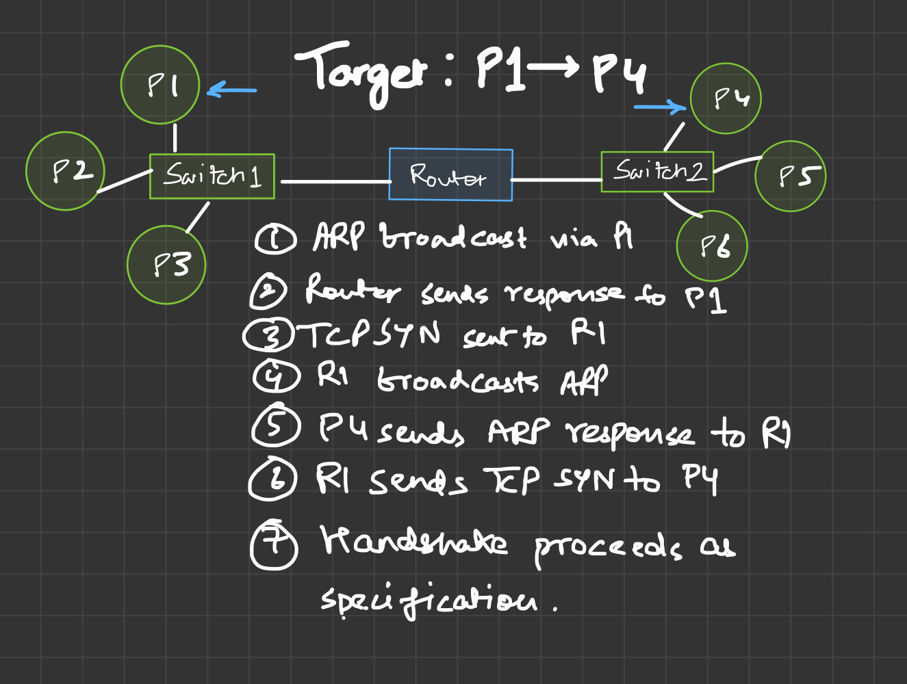

# `nmap`: Port scanning tool

### Section 1 in notes

### Networking layers and aggregation


## Subnetworks

**Teminology**
- Network segment: Computers connected using same medium on same physical connection:: Physical connection
- Subnetwork: Multiple or same network segments configured to use same router:: Logical connection

Notes on `nmap`
- Component of active recon
- Discover more about a grp of hosts or a subnet
- Four main kinds of req used(or **scans**)
  - ARP requests
    - Useful for **subnet scans**
    - ARP is used for MAC address resolution
      - Generates a map of MAC address to IP address
    - ARP requests can't be routed and only works within the Link layer
    - *Hence, ARP requests only work within the same subnet
    - ARP req, when it reaches Subnet router(the default gateway), they can't be routed to other subnets routers(out of network) and they essentially die
  - ICMP requests
    - Uses `Type 8(Echo)` and `Type 0(Echo Reply)`
    - Preceded by ARP requests for mapping
  - TCP/UDP requests
    - Useful when ICMP req are blocked
    - 

### IP address enumeration

- List: `10.100.12.16 thm.co.uk 10.102.12.15 example.com`
- Range: `10.100.12.15-20`, `10.100.12-23.15-20`
- Subnet: `10.100.12.15/30`
- File lists: `nmap -iL host_lists.txt`

Get detailed list of hosts without scanning. :: `nmap -sL TARGETS`

Reverse DNS lookup done by default on all targets to fetch their Ip addresses. 
- Skip?? -> `-n`
- Query for offline hosts?? -> `-R`
- Use specific DNS server?? -> `--dns-servers DNS_SERVER`
- ***Use only host discovery and no port-scanning??** -> `--dns-servers DNS_SERVER`

### Live host discovery

Execution order to be followed:: `ARP scan`(on same subnet) -> `ICMP scans`(on same subnet or on network) -> `TCP/UDP scans`(network scanning)

**Discovering online hosts**

- `sudo` users
  - Local network scan: ARP req used.
  - Network scans: ICMP req, TCP ACK scan(port 80), TCP SYN scan(port 443), ICMP timestamp scan
- non-`sudo` users
  - Local network scan: ARP req used.
  - Network scans: TCP SYN scan(port 80, with full handshake), TCP SYN scan(port 443, with full handshake)

Ping scan used for finding live hosts and performs port scan over live hosts only. Use `-sn` for ONLY host scans.

Similar scan tool: [`arp-scan` via RoyHills](https://github.com/royhills/arp-scan)

### ARP scanning

`nmap -PR -sn TARGETS`


### ICMP scans

- Types (all not listed):
  - ECHO
  - Timestamp
  - Address Mask
- ICMP Scan working::
  - `ping` scan(`-PE` flag)
    -  `ping` req(*ICMP Type 8/Echo*) sent to all hosts
    -  `ping` res(*ICMP Type 0*) is checked.
  - Timestamp(`-PP`)::
  -  req(*Type 13*) sent to all hosts
  -  res(*Type 14*) is checked.
  - Address Mask(`-PM`)::
  -  req(*Type 17*) sent to all hosts
  -  res(*Type 18*) is checked. 
- Firewalls(many of 'em) block **ICMP-echo req**

```shell
sudo nmap -PE -sn TARGETS
sudo nmap -PP -sn TARGETS
sudo nmap -PM -sn TARGETS
```

### TCP/UDP scans

Partially populated TCP header flags can be sent for scanning purposes. TCP handshakes not completed if `root` privileges present. Otherwise in all cases handshakes are done.

**Examples:**
- TCP SYN Ping scans
  - `sudo nmap -PS -sn TARGETS`
  - Send TCP packet(SYN flag, port: 80)
  - Wait for 
    - Open port:TCP packet(**SYN+ACK** flag)
    - Closed port:TCP packet(**RST** flag)
    - Any of above responses, ***if rcv*** will show that **host is up**
  - *TCP SYN Ping scans with ports*
    - `sudo nmap -PS21-25 -sn TARGETS`, `sudo nmap -PS21,24,443 -sn TARGETS`, 
    - Send TCP packet(**SYN** flag, port: 21-25)
    - Wait for 
      - Open ports:TCP packet(**SYN+ACK** flag)
      - Closed ports:TCP packet(**RST** flag)
- TCP ACK Ping scans
  - `sudo nmap -PA -sn TARGETS`, `sudo nmap -PA443-448 -sn TARGETS`, `sudo nmap -PA443,500,675 -sn TARGETS`
  - Send TCP packet(**ACK** flag, port: 80)
  - Wait for 
    - Closed port:TCP packet(**RST** flag)
    - **RST** flag is rcv via open ports since no active connections are open
- UDP ping
  - `sudo nmap -PU -sn TARGET`
  - UDP packets sent
  - Packet sent
    - To closed ports: `ICMP port unreachable(Type 3, Code 3)` packet
    - To open ports: No response rcv

**In the end, docs and associated [code](https://github.com/nmap/nmap) are the best**
Similar scan tool: [`masscan`](https://github.com/robertdavidgraham/masscan)

### Experiment notes and questions

- How will we get info(*IP addresses and subnet ranges*) about targets?
  - Reverse DNS pre-built, but is limited
- Why without `sudo` access, we can't do the partial TCP/UDP scans
- How is a message sent over the network when ARP resolution messages die out of the subnet?


### Tools required

- Wireshark